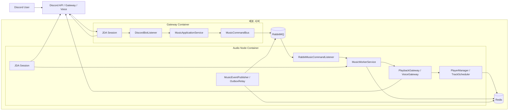
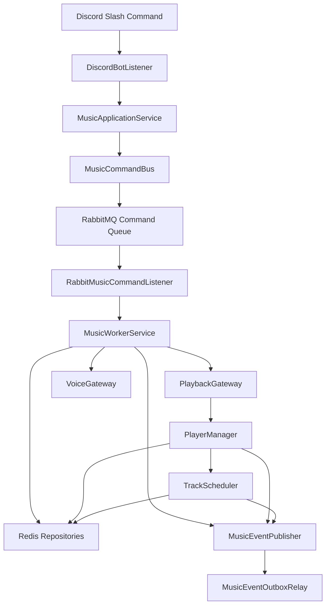

# 현재 아키텍처 문서

## 1. 문서 목적

이 문서는 현재 코드베이스 기준 아키텍처를 한 번에 이해하기 위한 문서다.

정리 범위는 아래와 같다.

- 현재 배포 토폴로지
- 런타임 데이터 흐름
- 컴포넌트별 특징
- 각 컴포넌트가 담당하는 실제 워크로드
- 운영 관점에서 봐야 하는 포인트

## 2. 전체 배포 다이어그램

## 3. 내부 논리 다이어그램

## 4. 핵심 흐름

### 명령 처리 흐름

1. 사용자가 Discord slash command를 호출한다.
2. `gateway`의 `DiscordBotListener`가 명령을 받는다.
3. `MusicApplicationService`가 Discord 요청을 `MusicCommand`로 변환한다.
4. `MusicCommandBus`가 RabbitMQ로 command를 전달한다.
5. `audio-node`의 `RabbitMusicCommandListener`가 command를 소비한다.
6. `MusicWorkerService`가 실제 비즈니스 로직을 수행한다.
7. 재생 제어는 `PlaybackGateway`, 음성 채널 연결은 `VoiceGateway`가 처리한다.
8. 결과는 `CommandResult`로 gateway 쪽에 돌아간다.

### 재생 상태 흐름

1. track load, next track selection, skip, stop, clear 요청이 들어온다.
2. `PlayerManager`와 `TrackScheduler`가 재생 전이를 결정한다.
3. 현재 재생 상태와 큐는 Redis 저장소에 반영된다.
4. 관련 상태 변화는 `MusicEventPublisher`를 통해 이벤트로 남는다.

### 장애 복구 흐름

1. `audio-node`가 ready 상태가 되면 `PlaybackRecoveryReadyListener`가 실행된다.
2. `PlaybackRecoveryService`가 Redis에 저장된 길드 상태와 플레이어 상태를 조회한다.
3. 연결해야 할 음성 채널과 현재 곡 또는 큐를 기준으로 복구를 시도한다.

### 이벤트 발행 흐름

1. Worker나 scheduler에서 상태 변화가 생긴다.
2. `MusicEventFactory`가 `schemaVersion`, `correlationId`를 포함한 이벤트를 만든다.
3. RabbitMQ 발행 성공 시 즉시 종료한다.
4. 실패 시 outbox에 저장한다.
5. `MusicEventOutboxRelay`가 claim / lease 방식으로 재전송한다.

## 5. 컴포넌트별 정리

### 5.1 Gateway 역할

| 항목 | 내용 |
| --- | --- |
| 대표 컴포넌트 | `DiscordBotListener`, `DiscordCommandRegistrationListener`, `MusicApplicationService`, `MusicCommandBus` |
| 특징 | 사용자 입력에 가장 먼저 닿는 진입점이며, 가능한 한 얇게 유지된다. |
| 하는 일 | slash command 수신, 입력 검증, command 변환, command bus 호출, Discord 응답 반환 |
| 주 워크로드 | 짧고 빈번한 요청-응답형 워크로드, burst 형태의 command 처리, autocomplete 처리 |
| 상태 성격 | 가능하면 무상태에 가깝게 유지, 실제 재생 상태는 Redis와 audio-node가 보유 |
| 운영 포인트 | Discord API rate limit, command 응답 지연, JDA 세션 안정성 |

### 5.2 Audio Node 역할

| 항목 | 내용 |
| --- | --- |
| 대표 컴포넌트 | `RabbitMusicCommandListener`, `MusicWorkerService`, `PlaybackRecoveryReadyListener` |
| 특징 | 실제 재생을 담당하는 실행 노드이며 상태 전이와 복구 책임이 집중된다. |
| 하는 일 | RabbitMQ command 소비, 음성 채널 연결, track 재생, recovery, event 발행 |
| 주 워크로드 | 장시간 유지되는 비동기 I/O 워크로드, 음성 세션 유지, 재생 상태 전이 |
| 상태 성격 | Redis에 저장된 큐 / 플레이어 상태를 source of truth로 사용 |
| 운영 포인트 | voice reconnect, recovery 정확성, long-running playback 처리 안정성 |

### 5.3 Command Bus

| 항목 | 내용 |
| --- | --- |
| 대표 컴포넌트 | `MusicCommandBus`, `InProcessMusicCommandBus`, `RabbitMusicCommandBus`, `MusicCommandMessageFactory` |
| 특징 | command transport를 교체 가능하게 만든 경계다. |
| 하는 일 | `MusicCommand`를 envelope로 감싸서 in-process 또는 RabbitMQ로 전달 |
| 주 워크로드 | 짧은 RPC형 요청, command burst, timeout 관리 |
| 상태 성격 | 자체 상태는 거의 없고 transport 책임만 가짐 |
| 운영 포인트 | RPC timeout, producer identity, command envelope 버전 관리 |

### 5.4 Command Consumer / Dedup / DLQ

| 항목 | 내용 |
| --- | --- |
| 대표 컴포넌트 | `RabbitMusicCommandListener`, `ProcessedCommandRepository`, `CommandDlqReplayService` |
| 특징 | 멱등성과 실패 격리를 담당하는 운영 안전장치다. |
| 하는 일 | command 중복 차단, 실패 시 DLQ 전송, 운영 시 DLQ 재처리 |
| 주 워크로드 | 중복 command 방어, 예외 처리, 장애 후 운영 복구 |
| 상태 성격 | `commandId` 기준 처리 결과를 Redis 또는 메모리에 저장 |
| 운영 포인트 | DLQ 누적량, 재처리 성공률, 중복 명령 패턴 |

### 5.5 Worker Core

| 항목 | 내용 |
| --- | --- |
| 대표 컴포넌트 | `MusicWorkerService`, `DiscordReferenceResolver` |
| 특징 | Discord 객체 의존을 최대한 경계 밖으로 밀어낸 포조 코어다. |
| 하는 일 | join, leave, play, stop, skip, queue, clear, pause, resume, sfx 처리 |
| 주 워크로드 | 비즈니스 규칙 실행, 상태 변경, 게이트웨이 호출 조합 |
| 상태 성격 | 자체 저장 상태는 없고 저장소와 게이트웨이를 사용 |
| 운영 포인트 | command 처리 시간, 예외 경로, Discord 참조 해석 실패 |

### 5.6 Playback Engine

| 항목 | 내용 |
| --- | --- |
| 대표 컴포넌트 | `PlaybackGateway`, `LavaPlayerPlaybackGateway`, `PlayerManager`, `TrackScheduler`, `GuildMusicManager` |
| 특징 | 재생 엔진과 전이 로직이 집중된 영역이다. |
| 하는 일 | track load, queue poll, next track 결정, autoplay, stop, skip, recovery playback |
| 주 워크로드 | CPU보다는 I/O와 상태 전이 중심, 길드별 장시간 재생 세션 |
| 상태 성격 | 로컬 런타임 버퍼는 최소화하고 Redis 큐 / 플레이어 상태 사용 |
| 운영 포인트 | track load 실패율, 다음 곡 전이 정확성, 길드 단위 락 동작 |

### 5.7 Voice Gateway

| 항목 | 내용 |
| --- | --- |
| 대표 컴포넌트 | `VoiceGateway`, `JdaVoiceGateway` |
| 특징 | Discord 음성 연결과 관련된 외부 연동 경계다. |
| 하는 일 | 음성 채널 connect / disconnect, guild voice 상태 제어 |
| 주 워크로드 | 네트워크 I/O, Discord 세션 상태 전이 |
| 상태 성격 | 지속 상태는 Redis에 두고 연결 수행 자체만 담당 |
| 운영 포인트 | reconnect, permission 문제, voice state mismatch |

### 5.8 Event Publisher / Outbox

| 항목 | 내용 |
| --- | --- |
| 대표 컴포넌트 | `MusicEventPublisher`, `RabbitMusicEventPublisher`, `RabbitMusicEventSender`, `MusicEventOutboxRelay` |
| 특징 | 상태 변화를 신뢰성 있게 외부로 내보내기 위한 경계다. |
| 하는 일 | 이벤트 발행, publish confirm 확인, 실패 시 outbox 저장, 재전송 |
| 주 워크로드 | 짧은 비동기 publish, 실패 재시도, batch replay |
| 상태 성격 | outbox는 Redis 또는 메모리에 저장 |
| 운영 포인트 | confirm timeout, nack, outbox backlog, replay 지연 |

### 5.9 Redis 저장소 계층

| 항목 | 내용 |
| --- | --- |
| 대표 컴포넌트 | `RedisGuildStateRepository`, `RedisQueueRepository`, `RedisPlayerStateRepository`, `RedisProcessedCommandRepository`, `RedisMusicEventOutboxRepository` |
| 특징 | 현재 분리 배포 구조의 shared source of truth다. |
| 하는 일 | 길드 상태, 큐, 플레이어 상태, command dedup, outbox 저장 |
| 주 워크로드 | 짧고 잦은 읽기/쓰기, recovery 조회, 멱등 상태 조회 |
| 상태 성격 | 영속성 중심, 다중 프로세스 간 공유 상태 |
| 운영 포인트 | ping health, key TTL, outbox claim lease 정확성 |

### 5.10 RabbitMQ

| 항목 | 내용 |
| --- | --- |
| 대표 컴포넌트 | command exchange / queue / DLQ, event exchange |
| 특징 | 서비스 간 결합을 느슨하게 만드는 메시지 백본이다. |
| 하는 일 | command RPC 전달, failed command 격리, event 전달 |
| 주 워크로드 | burst command 처리, 이벤트 fan-out 기반 전달 준비 |
| 상태 성격 | 영속 큐 기반 중간 저장소 |
| 운영 포인트 | queue depth, DLQ depth, consumer lag |

### 5.11 운영 모드

| 항목 | 내용 |
| --- | --- |
| 대표 컴포넌트 | `CommandDlqReplayRunner`, `ops/replay-command-dlq.sh`, `ops/smoke-check.sh` |
| 특징 | 평시 서비스와 별도로 운영자가 문제를 정리할 수 있는 보조 경로다. |
| 하는 일 | command DLQ 재처리, 배포 직후 health 점검 |
| 주 워크로드 | 수동 실행형 운영 워크로드, 배치성 점검 작업 |
| 상태 성격 | 평시 상시 트래픽용이 아니라 운영 작업 전용 |
| 운영 포인트 | 재처리 중복 여부, 재처리 실패 로그, 배포 후 빠른 정상성 확인 |

### 5.12 배포 파이프라인

| 항목 | 내용 |
| --- | --- |
| 대표 컴포넌트 | GitHub Actions, `deploy.sh`, `docker-compose.yml` |
| 특징 | 이미지 tar.gz 업로드 후 서버에서 `docker load`하는 보수적 배포 방식이다. |
| 하는 일 | build, image packaging, env 업로드, remote deploy, current release 갱신 |
| 주 워크로드 | CI 빌드, artifact 전송, 서버 side compose 갱신 |
| 상태 성격 | 릴리스 디렉터리 기반 배포 이력 유지 |
| 운영 포인트 | SSH 연결, env 동기화, release rollback 전략 |

## 6. 워크로드 성격별 분류

### 저지연 요청-응답형 워크로드

- `DiscordBotListener`
- `MusicApplicationService`
- `MusicCommandBus`
- autocomplete 처리

특징:

- 사용자가 바로 체감하는 지연 구간
- 빠른 응답과 예외 메시지 품질이 중요

### 장시간 상태 유지형 워크로드

- `MusicWorkerService`
- `PlaybackGateway`
- `PlayerManager`
- `TrackScheduler`
- voice 연결

특징:

- 길드별 세션이 오래 살아 있음
- 중간 장애 복구와 상태 정합성이 중요

### 공유 상태 관리형 워크로드

- Redis 저장소 계층
- command dedup
- queue / player state
- outbox

특징:

- 다중 프로세스 간 정합성을 맞추는 역할
- 읽기/쓰기 빈도가 높고 장애 시 영향 범위가 큼

### 운영 보조형 워크로드

- DLQ 재처리
- 배포 후 스모크 체크
- health 확인

특징:

- 상시 서비스 트래픽이 아니라 운영자 실행형 작업
- 문제를 빨리 좁히고 복구하는 데 목적이 있음

## 7. 현재 구조의 강점

- gateway와 audio-node 책임이 명확하게 분리되어 있음
- command와 event 경계가 코드로 고정되어 있음
- Redis가 공통 상태의 source of truth 역할을 수행함
- command dedup, DLQ, event outbox, confirm, claim / lease까지 운영 안정장치가 들어가 있음
- 배포와 운영 스크립트가 리포지토리 안에 같이 관리됨

## 8. 현재 구조의 주의점

- `gateway`와 `audio-node`가 같은 봇 토큰으로 각각 JDA 세션을 연다.
- 이 구조는 코드상 분리는 되어 있지만 실제 Discord 운영 정책과 세션 안정성은 실환경 검증이 필요하다.
- observability 스택은 아직 본격적으로 붙지 않았다.
- 현재는 `Gateway -> Worker -> Audio Node` 완전 3프로세스가 아니라 `gateway 역할 + audio-node 역할 + 내부 worker core` 구조다.

## 9. 바로 봐야 하는 문서

- 전체 구조 요약: [CODEBASE_ANALYSIS.md](C:/Users/s0302/OneDrive/바탕%20화면/portpolio/dis/CODEBASE_ANALYSIS.md)
- 이벤트 계약: [EVENT_CONTRACT.md](C:/Users/s0302/OneDrive/바탕%20화면/portpolio/dis/EVENT_CONTRACT.md)
- 운영 절차: [OPERATIONS_RUNBOOK.md](C:/Users/s0302/OneDrive/바탕%20화면/portpolio/dis/OPERATIONS_RUNBOOK.md)
- 서버 배포 스크립트: [SERVER_DEPLOY_SCRIPT.md](C:/Users/s0302/OneDrive/바탕%20화면/portpolio/dis/SERVER_DEPLOY_SCRIPT.md)
- 작업 로그: [CODEX_WORK_LOG.md](C:/Users/s0302/OneDrive/바탕%20화면/portpolio/dis/CODEX_WORK_LOG.md)
