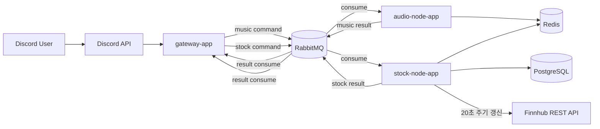

# DIS

DIS는 Discord 기반 음악 봇과 모의투자 주식 기능을 함께 운영하는 멀티 애플리케이션 저장소다.

현재 구성은 다음과 같다.

- `gateway-app`
  - Discord slash command 진입점
  - `deferReply` 시작
  - RabbitMQ command publish
  - result event 수신 후 Discord 응답 수정
- `audio-node-app`
  - 음악 명령 worker
  - 재생, 복구, idle disconnect 담당
- `stock-node-app`
  - 주식 명령 worker
  - Redis quote cache, PostgreSQL persistence, 랭킹/시즌 계산 담당
- `modules/common-core`
  - 음악 쪽 공용 계약, playback 코어, RabbitMQ/Redis/JDA 인프라
- `modules/stock-core`
  - 주식 쪽 공용 command/result 계약

## 아키텍처



## 현재 기능

### 음악

- `/join`
- `/leave`
- `/play`
- `/stop`
- `/skip`
- `/queue`
- `/clear`
- `/pause`
- `/resume`
- `/sfx`

### 주식

- `/stock quote`
- `/stock list`
- `/stock buy`
- `/stock sell`
- `/stock balance`
- `/stock portfolio`
- `/stock history`
- `/stock rank`

## Discord 응답 정책

- 음악 명령은 기본적으로 비공개 응답으로 시작한다.
- 주식 명령은 다음처럼 나뉜다.
- `quote`, `list`, `balance`, `portfolio`, `history`는 비공개 응답
- `buy`, `sell`, `rank`는 공개 응답

## 주식 시스템 요약

- 실제 투자 기능이 아닌 모의투자 게임이다.
- 시즌 기준은 `Asia/Seoul` 기준 월 단위다.
- 매월 1일 00:00에 새 시즌으로 넘어간다.
- 시즌 시작 자금은 `10,000`이다.
- `/stock buy`는 기본 1배, 최대 50배 레버리지를 지원한다.
- 50배 레버리지는 강한 경고 문구를 반환한다.
- 미국 시가총액 상위 10개 종목 watchlist를 기본값으로 사용한다.
- Finnhub REST API는 Discord 명령 처리 중 직접 호출하지 않는다.
- `stock-node-app`이 20초마다 상위 10개 시세를 갱신하고 Redis cache에 저장한다.
- Redis quote TTL은 60초다.
- 거래는 45초 이내 fresh quote가 있을 때만 허용된다.
- 기본 provider 보호 한도는 분당 `60`, 일간 `100000`이다.
- 현재 주기와 종목 수 기준 예상 호출량은 분당 `30`, 일간 `43200`이다.

## 빠른 시작

### 1. 환경 변수 준비

```powershell
Copy-Item .env.example .env
```

필수 값:

- `DISCORD_TOKEN`
- `RABBITMQ_USERNAME`
- `RABBITMQ_PASSWORD`

주식 기능 기본값:

- `POSTGRES_DB=stock`
- `POSTGRES_USER=stock`
- `POSTGRES_PASSWORD=stock`
- `STOCK_QUOTE_PROVIDER=mock`

Finnhub 사용 시:

```env
STOCK_QUOTE_PROVIDER=finnhub
FINNHUB_API_KEY=<your-key>
STOCK_PROVIDER_PER_MINUTE_LIMIT=60
STOCK_PROVIDER_PER_DAY_LIMIT=100000
```

### 2. 전체 빌드

```powershell
.\gradlew.bat bootJarAll
```

### 3. 로컬 실행

```powershell
docker compose up -d --build
```

관측성 포함:

```powershell
docker compose --profile observability up -d --build
```

## 주요 포트

- Gateway actuator: `8081`
- Audio Node actuator: `8082`
- Stock Node actuator: `8083`
- Redis: `6379`
- RabbitMQ AMQP: `5672`
- RabbitMQ UI: `15672`
- PostgreSQL: `5432`
- Grafana: `3000`
- Prometheus: `9090`
- Loki: `3100`
- Alloy UI: `12345`

## PostgreSQL

주식 영속 계층은 PostgreSQL을 사용한다. 현재 핵심 테이블은 다음과 같다.

- `stock_account`
- `stock_position`
- `trade_ledger`
- `allowance_ledger`
- `account_snapshot`
- `stock_watchlist`

자세한 스키마 설명은 [POSTGRESQL_STOCK_SCHEMA.md](docs/POSTGRESQL_STOCK_SCHEMA.md)를 본다.

## 관측성

현재 observability stack은 다음으로 구성된다.

- Prometheus
- Loki
- Alloy
- Grafana
- redis-exporter

중요한 점:

- 현재 Prometheus scrape 대상은 `gateway-app`, `audio-node-app`, `redis-exporter`, `rabbitmq`, `prometheus`, `loki`, `alloy`다.
- `stock-node-app`은 아직 Prometheus scrape 대상에 포함되지 않았다.

## 배포

GitHub Actions `Deploy Bot` 워크플로우가 `main` push 기준으로 동작한다.

- `clean test bootJarAll`
- Docker image build
- tar.gz 업로드
- 원격 서버에서 `deploy.sh` 실행

자세한 흐름은 [SERVER_DEPLOY_SCRIPT.md](docs/SERVER_DEPLOY_SCRIPT.md)를 본다.

## 문서

- [문서 인덱스](docs/README.md)
- [현재 아키텍처](docs/CURRENT_ARCHITECTURE.md)
- [모듈 구조](docs/MODULE_STRUCTURE.md)
- [이벤트 계약](docs/EVENT_CONTRACT.md)
- [운영 런북](docs/OPERATIONS_RUNBOOK.md)
- [PostgreSQL 스키마](docs/POSTGRESQL_STOCK_SCHEMA.md)
- [CI 테스트 가이드](docs/CI_TESTING.md)
- [관측성 계획](docs/OBSERVABILITY_PLAN.md)
