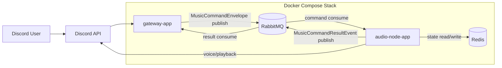

# Discord Music Bot

Discord slash command 기반 음악 봇입니다. 현재 저장소는 `gateway-app + audio-node-app + common-core` 구조로 분리되어 있고, 사용자 응답은 기본적으로 Discord ephemeral reply로 처리되며, 명령 전달은 RabbitMQ 비동기 이벤트 흐름으로 구성되어 있습니다.

단일 앱 안에서 모든 것을 처리하는 형태가 아니라, Discord 진입점과 실제 재생 워커를 분리해서 운영하는 구조입니다. 덕분에 slash command 응답, 재생 처리, 상태 복구, 관측성을 각 책임에 맞게 나눠서 관리할 수 있습니다.

## 1. 프로젝트 소개

이 프로젝트는 Discord 서버에서 음악 명령을 처리하기 위한 봇입니다.

- `gateway-app`
  - Discord slash command 진입점
  - `deferReply(true)` 기반 deferred ephemeral 응답 시작
  - RabbitMQ command publish
  - command result event를 받아 original ephemeral reply 수정
- `audio-node-app`
  - RabbitMQ command consumer
  - 실제 음성 채널 연결, 로드, 재생, 복구, 유휴 퇴장 처리
  - command 처리 결과를 RabbitMQ result event로 발행
- `modules/common-core`
  - 공용 command / event 계약
  - playback 코어 로직
  - Redis / RabbitMQ / JDA 연동
  - 공용 Spring bootstrap / observability 설정

## 2. 핵심 기능

- Discord slash command 기반 음악 제어
- deferred ephemeral reply 기반 사용자별 응답
- RabbitMQ 비동기 command publish / result event consume
- Redis 기반 재생 상태 공유 및 복구
- audio-node 재기동 이후 playback recovery
- 음성 채널 유휴 상태 감지 및 자동 퇴장
- Prometheus, Grafana, Loki, Alloy 기반 관측성 구성
- GitHub Actions + remote deploy 스크립트 기반 배포 자동화

## 3. 시스템 구성



현재 명령 처리 경로는 다음과 같습니다.

1. 사용자가 slash command를 실행합니다.
2. `gateway-app`이 `deferReply(true)`로 응답을 선점합니다.
3. gateway가 `MusicCommandEnvelope`를 RabbitMQ로 발행합니다.
4. `audio-node-app`이 command를 소비하고 실제 재생 로직을 수행합니다.
5. 결과를 `MusicCommandResultEvent`로 다시 RabbitMQ에 발행합니다.
6. gateway가 result event를 받아 original ephemeral reply를 수정합니다.

즉, 현재 구조는 RPC 응답을 기다리는 방식이 아니라 비동기 command / result 이벤트 흐름으로 Discord 응답을 마무리합니다.

## 4. 채택한 기술과 이유

### Java 21 / Spring Boot / Gradle

- 애플리케이션 진입점, 설정, 메시징, 관측성 구성을 일관되게 관리하기 좋습니다.
- actuator, configuration, bootstrap 구성을 통해 운영 편의성을 확보했습니다.

### JDA

- Discord slash command와 voice gateway를 다루기 위한 핵심 라이브러리입니다.
- interaction 응답과 음성 연결 책임을 명확하게 분리하기 좋았습니다.

### RabbitMQ

- gateway와 audio-node 사이 command / result transport 역할을 맡습니다.
- request/reply보다 비동기 publish / consume 구조가 현재 봇 아키텍처와 더 잘 맞습니다.

### Redis

- shared source of truth 역할을 합니다.
- guild state, queue state, player state, processed command 등을 보관하고 복구 흐름의 기반이 됩니다.

### Docker Compose

- gateway, audio-node, Redis, RabbitMQ, observability stack을 한 번에 띄우기 쉽습니다.
- 로컬 개발과 원격 서버 운영의 차이를 줄이는 데 유리합니다.

### Prometheus / Grafana / Loki / Alloy

- 메트릭, 로그, 알림을 한 스택으로 묶어서 운영할 수 있습니다.
- 현재 구조에서는 ELK보다 가볍고, compose 환경에서 바로 붙이기 좋습니다.

## 5. 프로젝트 구조

```text
apps/
  gateway-app/
    src/main/java/discordgateway/gateway/
      application/
      config/
      interaction/
      messaging/
      presentation/discord/
  audio-node-app/
    src/main/java/discordgateway/audionode/
      config/
      lifecycle/
      recovery/
modules/
  common-core/
    src/main/java/discordgateway/common/
      bootstrap/
      command/
      event/
    src/main/java/discordgateway/playback/
      application/
      audio/
      domain/
    src/main/java/discordgateway/infra/
      audio/
      discord/
      messaging/rabbit/
      redis/
docs/
ops/
docker-compose.yml
deploy.sh
```

### 모듈별 책임

- `apps/gateway-app`
  - Discord interaction 처리
  - command envelope 생성
  - pending interaction 관리
  - result event 소비 후 사용자 응답 수정
- `apps/audio-node-app`
  - command 소비
  - 실제 playback 실행
  - recovery / idle disconnect 수행
  - result event 발행
- `modules/common-core`
  - 공용 계약과 playback 코어 로직 제공
  - Redis, RabbitMQ, Discord/JDA 연동 구현 포함

## 6. 빠른 시작

### 1. 환경 변수 준비

```powershell
Copy-Item .env.example .env
```

최소 필요 값:

- `DISCORD_TOKEN`
- `RABBITMQ_USERNAME`
- `RABBITMQ_PASSWORD`

선택 값:

- `DISCORD_DEV_GUILD_ID`
- `YOUTUBE_REFRESH_TOKEN`
- `YOUTUBE_PO_TOKEN`
- `YOUTUBE_VISITOR_DATA`
- `YOUTUBE_REMOTE_CIPHER_*`
- `GRAFANA_*`

### 2. 전체 빌드

```powershell
.\gradlew.bat bootJarAll
```

산출물:

- `apps/gateway-app/build/libs/gateway-app.jar`
- `apps/audio-node-app/build/libs/audio-node-app.jar`

### 3. 로컬 실행

기본 스택:

```powershell
docker compose up -d --build
```

관측성 포함:

```powershell
docker compose --profile observability up -d --build
```

### 4. 개별 실행

Gateway:

```powershell
.\gradlew.bat :apps:gateway-app:bootJar
java -jar apps/gateway-app/build/libs/gateway-app.jar
```

Audio Node:

```powershell
.\gradlew.bat :apps:audio-node-app:bootJar
java -jar apps/audio-node-app/build/libs/audio-node-app.jar
```

## 7. 주요 포트

- Gateway actuator: `8081`
- Audio Node actuator: `8082`
- Redis: `6379`
- RabbitMQ AMQP: `5672`
- RabbitMQ UI: `15672`
- Grafana: `3000`
- Prometheus: `9090`
- Loki: `3100`
- Alloy UI: `12345`

## 8. 관측성

현재 관측성 스택은 아래 구성으로 정리되어 있습니다.

- Prometheus metrics
- ECS JSON structured logging
- Loki + Alloy 로그 수집
- Grafana datasource / dashboard provisioning
- Prometheus alert rule
- Grafana managed alert rule
- Discord webhook 알림 경로

기본 수신처는 `observability-noop`입니다. 실제 Discord 알림을 켜려면 아래 값을 설정하면 됩니다.

- `GRAFANA_ALERT_DEFAULT_RECEIVER=observability-discord`
- `GRAFANA_ALERT_DISCORD_WEBHOOK_URL=<실제 webhook>`

`OBSERVABILITY_ENABLED=true`면 원격 서버에서 `prometheus`, `loki`, `alloy`, `redis-exporter`, `grafana`도 함께 기동합니다.

## 9. 배포와 운영

GitHub Actions는 `main` push 기준으로 동작하며, 현재 배포는 아래를 포함합니다.

- `gateway-app` 이미지
- `audio-node-app` 이미지
- `docker-compose.yml`
- `ops/`
- `ops/observability/`
- `.env.cicd`

원격 서버에서는 `deploy.sh`가 release 디렉터리를 만들고 compose를 다시 올리는 방식으로 동작합니다.

운영 중 자주 쓰는 명령 예시는 다음과 같습니다.

전체 상태 확인:

```bash
docker compose --env-file .env ps
```

관측성 포함 상태 확인:

```bash
docker compose --profile observability --env-file .env ps
```

앱 로그 확인:

```bash
docker compose --project-name discord-bot --env-file .env logs gateway --tail=200
docker compose --project-name discord-bot --env-file .env logs audio-node --tail=200
```

배포 직후 smoke check:

```bash
bash /home/ubuntu/dis-bot/current/ops/smoke-check.sh
```

## 10. 현재 운영 관점에서 신경 쓴 부분

- Discord 응답을 기본적으로 ephemeral로 유지해 서버 채널에 공개 메시지를 남기지 않도록 구성했습니다.
- gateway와 audio-node를 분리해 slash command 응답과 실제 playback 워크로드를 나눴습니다.
- Redis를 source of truth로 사용해 재기동 이후 recovery 흐름을 설계했습니다.
- observability stack을 compose 기반으로 붙여 운영 상태 확인과 알림 구성을 빠르게 할 수 있게 했습니다.
- GitHub Actions와 remote deploy 스크립트를 묶어 배포 절차를 반복 가능하게 만들었습니다.

## 11. 현재 알려진 이슈와 개선 방향

### 현재 알려진 운영 이슈

- 원격 서버에서 YouTube 재생 결과가 로컬과 다르게 실패하는 경우가 있습니다.
- 현재까지는 코드 자체보다 서버 IP/ASN, YouTube anti-bot 응답 차이 영향 가능성이 더 크게 보입니다.
- Grafana 관리자 계정은 최초 기동 시점의 env 값이 우선 적용됩니다.

### 향후 개선 방향

- Loki 기반 로그 알림 추가
- 비즈니스 메트릭 추가
  - `music_commands_total`
  - `music_command_duration_seconds`
  - `music_track_load_failures_total`
  - `music_recovery_attempts_total`
- ngrok 또는 reverse proxy 환경에서 관측성 접근 경로 정리
- 배포 중 무중단성 개선

## 12. 문서

- [문서 인덱스](docs/README.md)
- [현재 아키텍처](docs/CURRENT_ARCHITECTURE.md)
- [코드베이스 분석](docs/CODEBASE_ANALYSIS.md)
- [모듈 구조](docs/MODULE_STRUCTURE.md)
- [이벤트 계약](docs/EVENT_CONTRACT.md)
- [운영 런북](docs/OPERATIONS_RUNBOOK.md)
- [배포 스크립트 가이드](docs/SERVER_DEPLOY_SCRIPT.md)
- [관측성 계획](docs/OBSERVABILITY_PLAN.md)
- [관측성 스택 안내](ops/observability/README.md)
- [작업 로그](docs/CODEX_WORK_LOG.md)

## 13. Stock Commands

현재 `/stock` 하위 명령은 아래를 지원합니다.

- `/stock quote symbol:<ticker[,ticker...]>`
- `/stock buy symbol:<ticker> amount:<cash>`
- `/stock sell symbol:<ticker> quantity:<qty>`
- `/stock balance`
- `/stock portfolio`
- `/stock history [limit]`
- `/stock rank period:<day|week|all>`

`/stock quote` supports one symbol or a comma/space separated list such as `AAPL,MSFT,NVDA`.

구현 경계는 아래와 같습니다.

- `gateway-app`
  - Discord slash command 진입
  - stock command envelope publish
  - stock result event 수신 후 interaction reply edit
- `stock-node-app`
  - quote / buy / sell / balance / portfolio / history / rank 처리
  - PostgreSQL persistence
  - Redis quote cache / rank cache

## 14. Stock Provider

stock quote provider는 설정으로 바꿀 수 있습니다.

기본값:

```env
STOCK_PROVIDER_TYPE=mock
```

실제 provider 사용 예시:

```env
STOCK_PROVIDER_TYPE=alphavantage
STOCK_PROVIDER_FALLBACK_TO_MOCK=true
ALPHAVANTAGE_API_KEY=<your-key>
ALPHAVANTAGE_ENTITLEMENT=
```

현재 지원 provider 타입:

- `mock`
- `alphavantage`

`alphavantage` 호출 실패 시 `STOCK_PROVIDER_FALLBACK_TO_MOCK=true`면 mock provider로 fallback 합니다.
