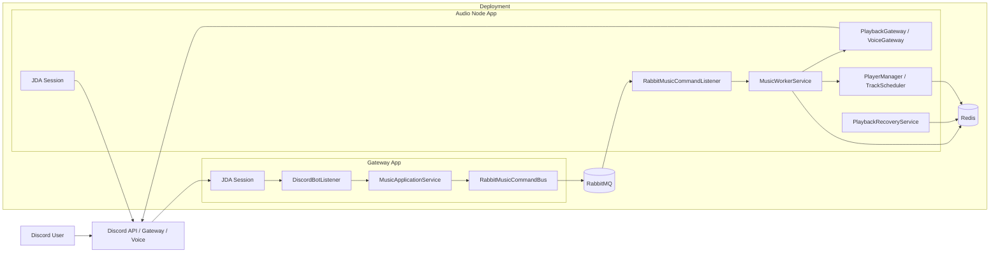

# 현재 아키텍처

## 1. 요약

현재 구조는 `gateway-app + audio-node-app + common-core` 3계층이다.

- `gateway-app`
  - Discord slash command 진입점
  - RabbitMQ command producer
- `audio-node-app`
  - RabbitMQ command consumer
  - 실제 재생과 recovery 실행 앱
- `common-core`
  - 공용 도메인, 재생 엔진, Redis 저장소, RabbitMQ command 인프라

중요한 점은 현재 구조가 더 이상 선택형 fallback을 두지 않는다는 점이다.

- 상태 저장: Redis 고정
- command transport: RabbitMQ 고정
- event publish: Spring local event 고정
- InMemory 구현: 제거
- InProcess command bus: 제거

## 2. 배포 다이어그램

## 3. 내부 처리 흐름

### 명령 흐름

1. 사용자가 slash command를 호출한다.
2. `gateway-app`의 `DiscordBotListener`가 요청을 받는다.
3. `MusicApplicationService`가 Discord 요청을 `MusicCommand`로 바꾼다.
4. `RabbitMusicCommandBus`가 RabbitMQ로 command를 보낸다.
5. `audio-node-app`의 `RabbitMusicCommandListener`가 command를 소비한다.
6. `MusicWorkerService`가 실제 로직을 실행한다.
7. 결과는 RPC 응답으로 gateway에 돌아간다.

### 재생 흐름

1. `MusicWorkerService`가 `PlaybackGateway`, `VoiceGateway`를 호출한다.
2. `PlayerManager`와 `TrackScheduler`가 트랙 로드, 큐 전이, skip, stop, clear를 처리한다.
3. 재생 상태와 큐 상태는 Redis에 저장된다.
4. 상태 변화는 Spring local event로 발행되고 로그에 남는다.

### 복구 흐름

1. `audio-node-app`이 기동된다.
2. JDA Ready 이후 `PlaybackRecoveryReadyListener`가 실행된다.
3. `PlaybackRecoveryService`가 Redis에서 guild/player/queue 상태를 읽는다.
4. 음성 채널 연결과 현재 곡 또는 큐 기준 복구를 시도한다.

## 4. 컴포넌트별 정리

### Gateway App

| 항목 | 내용 |
| --- | --- |
| 역할 | Discord 요청 수신, 입력 검증, command 생성, 즉시 응답 |
| 대표 컴포넌트 | `DiscordBotListener`, `MusicApplicationService`, `PlayAutocompleteService`, `RabbitMusicCommandBus` |
| 상태 성격 | 가능한 무상태에 가깝고, 실행 상태는 Redis에 두지 않음 |
| 주요 워크로드 | slash command burst, autocomplete, RPC 응답 대기 |

### Audio Node App

| 항목 | 내용 |
| --- | --- |
| 역할 | command 소비, 재생 실행, recovery, 상태 전이 |
| 대표 컴포넌트 | `RabbitMusicCommandListener`, `PlaybackRecoveryService`, `PlaybackRecoveryReadyListener` |
| 상태 성격 | 실행 중 상태를 Redis와 동기화 |
| 주요 워크로드 | 장시간 재생 세션, voice 연결, recovery |

### Common Core

| 항목 | 내용 |
| --- | --- |
| 역할 | 두 앱이 공유하는 도메인과 재생 코어 |
| 대표 컴포넌트 | `MusicWorkerService`, `PlayerManager`, `TrackScheduler`, `Redis*Repository` |
| 상태 성격 | 로컬 메모리를 source of truth로 사용하지 않음 |
| 주요 워크로드 | 재생 상태 전이, queue poll, Redis 읽기/쓰기 |

### Redis

| 항목 | 내용 |
| --- | --- |
| 역할 | 현재 구조의 shared source of truth |
| 저장 대상 | guild 상태, queue 상태, player 상태, command dedup |
| 특징 | 두 앱이 공통으로 참조하는 중앙 상태 저장소 |

### RabbitMQ

| 항목 | 내용 |
| --- | --- |
| 역할 | gateway와 audio-node 사이 command transport |
| 사용 범위 | command exchange, queue, DLQ, reply-to RPC |
| 특징 | 현재는 command 경로에만 사용 |

## 5. 현재 구조에서 제거된 것

- `InMemory*Repository`
- `InMemoryGuildPlaybackLockManager`
- `InProcessMusicCommandBus`
- `RabbitMusicEventPublisher`
- `RabbitMusicEventSender`
- `MusicEventOutboxRelay`
- `MusicEventOutboxRepository`
- `PendingMusicEvent`
- `app.role` 기반 역할 분기

즉 지금은 "현재 실제로 쓰는 경로만 남긴 구조"다.

## 6. 현재 확인 포인트

정상 기동 로그 예시:

- gateway
  - `startup-config application=gateway-app`
  - `commandBus=RabbitMusicCommandBus`
- audio-node
  - `startup-config application=audio-node-app`
  - `commandBus=none`

`audio-node`에서 `commandBus=none`은 정상이다. producer가 아니라 consumer이기 때문이다.
