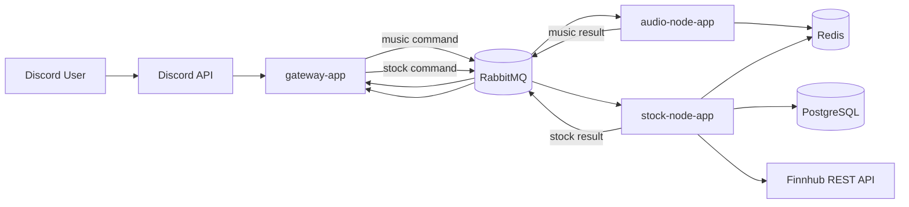
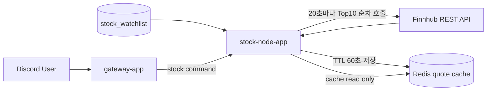

# 현재 아키텍처

## 요약

현재 저장소는 세 개의 실행 앱과 두 개의 공용 모듈로 구성된다.

- `gateway-app`
- `audio-node-app`
- `stock-node-app`
- `modules/common-core`
- `modules/stock-core`

음악과 주식은 모두 `gateway-app`에서 Discord 명령을 받고, 실제 작업은 각자 별도 worker가 처리한다.

## 전체 구성

## 노드별 책임

### gateway-app

- Discord slash command 진입점
- interaction `deferReply` 시작
- command envelope 생성
- RabbitMQ publish
- result event 수신 후 원래 응답 수정

### audio-node-app

- 음악 명령 consumer
- 실제 재생, queue 처리, recovery, idle disconnect
- Redis 상태 저장
- music result event publish

### stock-node-app

- 주식 명령 consumer
- quote 조회, 매수/매도, 잔고/포트폴리오/거래내역/랭킹 처리
- PostgreSQL 영속 계층 사용
- Redis quote cache와 rank cache 사용
- Finnhub REST API를 20초 주기로 호출해 quote cache 갱신

### modules/common-core

- 음악 command/event 계약
- playback 코어
- RabbitMQ/Redis/JDA 인프라 구현

### modules/stock-core

- 주식 command/result 계약
- stock 메시지 속성/프로토콜 정의

## 데이터 저장소별 역할

| 구성요소 | 역할 |
| --- | --- |
| Redis | 음악 상태 저장, pending interaction, stock quote cache, rank cache |
| RabbitMQ | music command/result, stock command/result 비동기 transport |
| PostgreSQL | stock account, position, ledger, snapshot, watchlist 저장 |

## 음악 명령 흐름

1. 사용자가 Discord에서 음악 slash command를 실행한다.
2. `gateway-app`이 비공개 deferred reply를 시작한다.
3. `gateway-app`이 `MusicCommandEnvelope`를 RabbitMQ로 publish한다.
4. `audio-node-app`이 consume 후 재생 로직을 처리한다.
5. 처리 결과를 `MusicCommandResultEvent`로 publish한다.
6. `gateway-app`이 result event를 받아 원래 interaction 응답을 수정한다.

## 주식 명령 흐름

1. 사용자가 Discord에서 `/stock` 하위 명령을 실행한다.
2. `gateway-app`이 subcommand에 따라 공개 또는 비공개 deferred reply를 시작한다.
3. `gateway-app`이 `StockCommandEnvelope`를 RabbitMQ로 publish한다.
4. `stock-node-app`이 consume 후 quote/거래/조회/랭킹 로직을 수행한다.
5. `stock-node-app`이 `StockCommandResultEvent`를 publish한다.
6. `gateway-app`이 result event를 받아 원래 interaction 응답을 수정한다.

## 주식 시세 갱신 흐름

중요한 정책:

- Discord 명령 처리 중 외부 API를 직접 호출하지 않는다.
- 거래는 Redis에 45초 이내 fresh quote가 있을 때만 허용한다.
- 조회는 stale quote도 허용하지만 지연 안내를 붙인다.

## Discord 응답 공개 범위

- 공개 응답
  - `/stock buy`
  - `/stock sell`
  - `/stock rank`
- 비공개 응답
  - 모든 음악 명령
  - `/stock quote`
  - `/stock list`
  - `/stock balance`
  - `/stock portfolio`
  - `/stock history`

## 관측성 현재 상태

- Prometheus scrape 대상
  - `gateway-app`
  - `audio-node-app`
  - `redis-exporter`
  - `rabbitmq`
  - `prometheus`
  - `loki`
  - `alloy`
- 현재 `stock-node-app`은 Prometheus scrape 대상에 포함되지 않았다.
