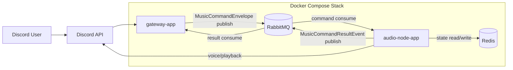
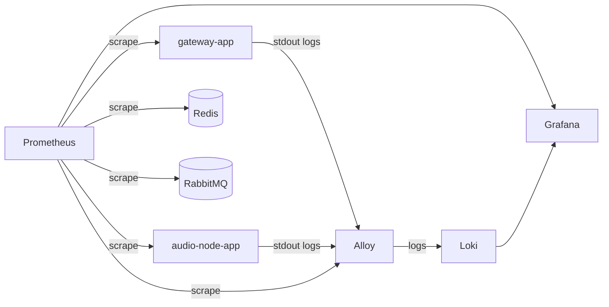

# 현재 아키텍처

## 요약

현재 시스템은 `gateway-app + audio-node-app + common-core` 구조다.

- `gateway-app`
  - Discord command 진입점
  - RabbitMQ command producer
  - RabbitMQ command result consumer
  - deferred ephemeral 응답 관리
- `audio-node-app`
  - RabbitMQ command consumer
  - 실제 재생, 복구, 유휴 퇴장 실행
  - RabbitMQ command result publisher
- `common-core`
  - 공용 계약
  - playback 코어
  - Redis / RabbitMQ / JDA 인프라

고정된 실행 경로:

- 상태 저장소: Redis
- 명령 transport: RabbitMQ async publish
- 명령 결과 transport: RabbitMQ direct exchange
- 내부 상태 이벤트: Spring local event

## 패키지 계층

- `discordgateway.gateway.*`
- `discordgateway.audionode.*`
- `discordgateway.common.*`
- `discordgateway.playback.*`
- `discordgateway.infra.*`

## 시스템 다이어그램

## 관측성 다이어그램

## 명령 흐름

1. 사용자가 Discord slash command를 호출한다.
2. `gateway-app`의 `DiscordBotListener`가 interaction을 받는다.
3. gateway가 `deferReply(true)`를 먼저 수행한다.
4. `MusicApplicationService`가 요청을 `MusicCommandEnvelope`로 변환한다.
5. `RabbitMusicCommandBus`가 envelope를 RabbitMQ에 publish한다.
6. `audio-node-app`의 `RabbitMusicCommandListener`가 command를 소비한다.
7. `MusicWorkerService`가 실제 비즈니스 로직을 실행한다.
8. 처리 결과는 `MusicCommandResultEvent`로 다시 RabbitMQ에 발행된다.
9. `gateway-app`의 `RabbitMusicCommandResultListener`가 result event를 받아 original ephemeral reply를 수정한다.

## 재생 흐름

1. `MusicWorkerService`가 playback / voice gateway를 호출한다.
2. `PlayerManager`가 곡 로드와 큐 반영을 처리한다.
3. `TrackScheduler`가 재생 전이와 다음 곡 결정을 처리한다.
4. 종료가 필요하면 `VoiceSessionLifecycleService`가 stop, clear, disconnect, state cleanup을 공통 처리한다.
5. `VoiceChannelIdleListener`와 `VoiceChannelIdleDisconnectService`가 유휴 음성 채널 퇴장을 수행한다.
6. 상태 변화는 Redis와 Spring local event, 구조 로그로 반영된다.

## 복구 흐름

1. `audio-node-app`이 기동한다.
2. JDA Ready 이후 `PlaybackRecoveryReadyListener`가 시작한다.
3. `PlaybackRecoveryService`가 Redis에서 guild / player / queue 상태를 읽는다.
4. 저장된 음성 채널과 현재 재생 상태를 기준으로 복구를 시도한다.

## 컴포넌트별 특징

### Gateway App

| 항목 | 내용 |
| --- | --- |
| 역할 | Discord 요청 수신, deferred ephemeral 응답 시작, command publish, result consume |
| 주요 클래스 | `DiscordBotListener`, `MusicApplicationService`, `RabbitMusicCommandBus`, `RabbitMusicCommandResultListener` |
| 상태 보유 | pending interaction Redis TTL registry |
| 워크로드 | slash command burst, autocomplete, result reply edit |

### Audio Node App

| 항목 | 내용 |
| --- | --- |
| 역할 | command 소비, 실제 재생, 복구, 유휴 퇴장, result 발행 |
| 주요 클래스 | `RabbitMusicCommandListener`, `PlaybackRecoveryService`, `VoiceChannelIdleDisconnectService`, `VoiceChannelIdleListener` |
| 상태 보유 | Redis를 source of truth로 사용 |
| 워크로드 | 음성 연결, 곡 로드, 재생, recovery, voice state 감시 |

### Common Core

| 항목 | 내용 |
| --- | --- |
| 역할 | 공용 계약과 코어 로직 제공 |
| 주요 클래스 | `MusicWorkerService`, `PlayerManager`, `TrackScheduler`, `ApplicationFactory` |
| 상태 보유 | 직접 상태를 갖지 않고 Redis 경로를 통해 접근 |
| 워크로드 | 코어 로직, bootstrap, 저장소 및 메시지 연결 |

### Redis

| 항목 | 내용 |
| --- | --- |
| 역할 | shared source of truth |
| 저장 대상 | guild state, queue state, player state, processed command |
| 비고 | in-memory fallback 제거 |

### RabbitMQ

| 항목 | 내용 |
| --- | --- |
| 역할 | gateway와 audio-node 사이 command / result transport |
| 사용 범위 | command exchange, command queue, command result exchange, DLQ |
| 비고 | RPC는 제거됨 |

## 관측성

- Actuator `health`, `info`, `prometheus`
- ECS JSON structured logging
- Grafana dashboard provisioning
- Prometheus alert rules
- Grafana managed alert rules
- Discord webhook 알림 경로

## 현재 운영 이슈

- YouTube 재생은 로컬과 원격 서버에서 결과 차이가 있다.
- 현재까지는 관측상 코드보다 서버 IP/ASN과 YouTube anti-bot 응답 차이 영향이 더 크다.
- Grafana 관리자 계정은 첫 기동 시점의 env만 반영된다.
