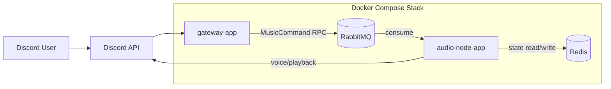
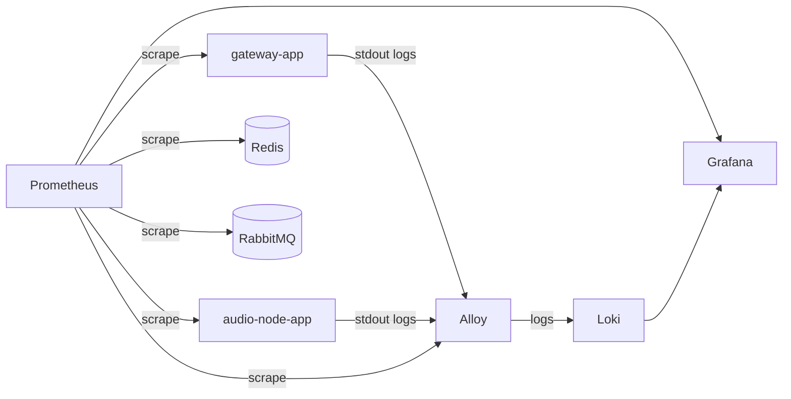

# 현재 아키텍처

## 1. 요약

현재 시스템은 `gateway-app + audio-node-app + common-core` 3계층 구조다.

- `gateway-app`
  - Discord slash command 진입점
  - RabbitMQ command producer
- `audio-node-app`
  - RabbitMQ command consumer
  - 실제 재생과 복구 수행
- `common-core`
  - 공용 도메인
  - 재생 엔진
  - Redis 저장소
  - RabbitMQ command 인프라
  - 공통 bootstrap

현재 설계에서 중요한 점은 fallback 경로를 제거하고 실제 운영 경로만 남겼다는 점이다.

- 상태 저장소: Redis
- 명령 transport: RabbitMQ RPC
- 이벤트 transport: Spring local event
- in-memory fallback: 없음
- in-process command bus: 없음

## 2. 런타임 다이어그램

## 3. 관측성 다이어그램

## 4. 명령 흐름

1. 사용자가 Discord slash command를 호출한다.
2. `gateway-app`의 `DiscordBotListener`가 interaction을 수신한다.
3. `MusicApplicationService`가 Discord 요청을 `MusicCommand`로 변환한다.
4. `RabbitMusicCommandBus`가 RabbitMQ RPC로 명령을 보낸다.
5. `audio-node-app`의 `RabbitMusicCommandListener`가 명령을 소비한다.
6. `MusicWorkerService`가 실제 비즈니스 로직을 수행한다.
7. 결과는 RPC 응답으로 gateway에 돌아간다.
8. gateway가 interaction 응답이나 follow-up 메시지를 정리한다.

## 5. 재생 흐름

1. `MusicWorkerService`가 `PlaybackGateway`, `VoiceGateway`를 호출한다.
2. `PlayerManager`가 트랙 로드, 큐 반영, 재생 시작을 제어한다.
3. `TrackScheduler`가 종료 후 다음 곡 전이를 제어한다.
4. 현재 상태는 Redis에 저장된다.
5. 상태 변화는 Spring local event로 발행되고 구조 로그로 남는다.

## 6. 복구 흐름

1. `audio-node-app`이 기동한다.
2. JDA Ready 이후 `PlaybackRecoveryReadyListener`가 실행된다.
3. `PlaybackRecoveryService`가 Redis에서 guild, player, queue 상태를 읽는다.
4. 저장된 voice channel과 현재 재생 상태를 기준으로 복구를 시도한다.

## 7. 컴포넌트별 특징

### Gateway App

| 항목 | 내용 |
| --- | --- |
| 역할 | Discord 요청 수신, command 생성, 즉시 응답 |
| 주요 클래스 | `DiscordBotListener`, `MusicApplicationService`, `PlayAutocompleteService`, `RabbitMusicCommandBus` |
| 상태 보유 | 직접 상태를 저장하지 않음 |
| 워크로드 | slash command burst, autocomplete, RPC 응답 대기 |

### Audio Node App

| 항목 | 내용 |
| --- | --- |
| 역할 | 명령 소비, 재생 실행, 복구, 상태 전이 |
| 주요 클래스 | `RabbitMusicCommandListener`, `PlaybackRecoveryService`, `PlaybackRecoveryReadyListener` |
| 상태 보유 | Redis를 source of truth로 사용 |
| 워크로드 | 음성 연결, 트랙 로드, 재생, recovery |

### Common Core

| 항목 | 내용 |
| --- | --- |
| 역할 | 공용 도메인, 인프라, 재생 코어 |
| 주요 클래스 | `MusicWorkerService`, `PlayerManager`, `TrackScheduler`, `ApplicationFactory` |
| 상태 보유 | 직접 보유하지 않고 Redis 경로만 사용 |
| 워크로드 | 상태 전이, 재생 제어, bootstrap |

### Redis

| 항목 | 내용 |
| --- | --- |
| 역할 | 현재 구조의 shared source of truth |
| 저장 대상 | guild 상태, queue 상태, player 상태, processed command |
| 비고 | in-memory fallback 없음 |

### RabbitMQ

| 항목 | 내용 |
| --- | --- |
| 역할 | gateway와 audio-node 사이의 command transport |
| 사용 범위 | command exchange, queue, DLQ, reply-to RPC |
| 비고 | event transport로는 사용하지 않음 |

## 8. 현재 구현된 관측성

- Actuator `health`, `info`, `prometheus`
- ECS JSON structured logging
- `application`, `node` 메트릭 태그
- Grafana 대시보드 2종
  - `Discord Bot App Overview`
  - `Discord Bot Infra Overview`
- Prometheus alert rules
- Grafana-managed alert rules
- `observability-noop`, `observability-discord` contact point provisioning

## 9. 현재 알려진 운영 이슈

- YouTube 재생은 로컬과 원격 서버에서 결과가 다를 수 있다.
- 현재까지의 관측 결과상 이 차이는 코드보다 서버 IP/ASN과 YouTube anti-bot 응답 차이의 영향을 많이 받는다.
- Grafana 관리자 계정은 첫 기동 시점에만 env가 반영된다. 기존 `grafana-data` 볼륨이 있으면 나중에 env를 바꿔도 계정은 자동으로 바뀌지 않는다.
