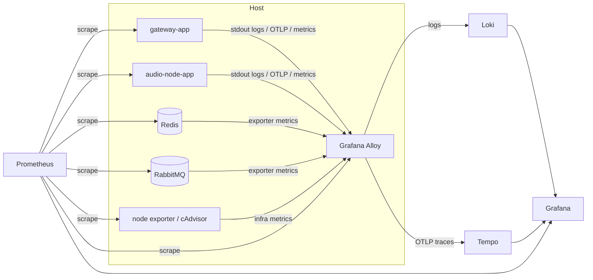

# 로그 수집 / 모니터링 계획

## 1. 전제

현재 저장소 기준 전제는 이렇다.

- 실행 앱은 `gateway-app`, `audio-node-app` 두 개다.
- 배포는 Docker Compose 중심이다.
- 상태 저장은 Redis가 맡는다.
- 명령 전달은 RabbitMQ가 맡는다.
- 앱은 Spring Boot Actuator를 이미 쓰고 있다.
- 현재 운영 규모는 대형 다중 클러스터보다 "특정 봇 + 소수 인스턴스"에 가깝다.

이 전제에서는 무거운 중앙 로그 스택보다 운영 복잡도를 낮추는 구성이 더 맞다. 이 판단은 현재 코드베이스와 배포 방식에 대한 설계 추론이다.

## 2. 권장 결론

현재 구조에서는 아래 조합이 1차 권장안이다.

- 로그: `Grafana Alloy + Loki`
- 메트릭: `Prometheus`
- 대시보드 / 알림: `Grafana`
- 트레이스: `OpenTelemetry + Tempo`를 2단계로 도입

한 줄로 줄이면 `Grafana OSS 스택`이 가장 맞다.

## 3. 왜 이 조합이 맞는가

### 3-1. Loki가 맞는 이유

Grafana Loki 공식 문서는 Loki가 로그 본문 전체가 아니라 라벨 메타데이터 중심으로 인덱싱한다고 설명한다. 이 방식은 인덱스를 가볍게 유지하고 운영 복잡도를 낮추는 데 유리하다.  
출처: https://grafana.com/docs/loki/latest/

현재 구조는 서비스 수가 많지 않고, 전문 검색엔진 수준의 자유 텍스트 검색보다 "장애 시 빠르게 흐름을 좁히는 것"이 더 중요하다. 그래서 지금은 ELK/OpenSearch보다 Loki 쪽이 더 맞다. 이 비교는 현재 운영 규모를 기준으로 한 설계 추론이다.

### 3-2. Prometheus가 맞는 이유

Prometheus 공식 문서는 HTTP metrics endpoint를 scrape하는 모델을 기본으로 설명한다.  
출처: https://prometheus.io/docs/prometheus/latest/getting_started/

Spring Boot 공식 문서는 `/actuator/prometheus` endpoint를 통해 Prometheus 형식 메트릭을 노출할 수 있다고 설명한다.  
출처: https://docs.spring.io/spring-boot/reference/actuator/metrics.html

지금 앱이 Spring Boot 기반이고 Actuator를 이미 쓰고 있으므로 Prometheus 방식이 자연스럽다.

### 3-3. Alloy를 collector로 권장하는 이유

Grafana 공식 문서는 Grafana Alloy를 OpenTelemetry Collector distribution으로 설명하고, 로그·메트릭·트레이스 경로를 한쪽으로 모으는 현재 권장 collector로 안내한다.  
출처: https://grafana.com/docs/alloy/latest/

즉 host마다 Alloy 하나를 두면 아래를 한 군데에서 정리할 수 있다.

- 컨테이너 stdout 로그 수집
- OTLP 수신
- 추후 trace 수집
- exporter 경로 통합

### 3-4. Promtail을 지금 새로 도입하면 안 되는 이유

Grafana 공식 문서 기준으로 Promtail은 2025년 2월 13일 LTS에 들어갔고, 2026년 3월 2일 EOL이다. 현재 날짜는 2026년 3월 18일이므로 이미 EOL 이후다.  
출처: https://grafana.com/docs/loki/latest/send-data/promtail/

즉 지금 시점에서 새 로그 수집기로 Promtail을 고르는 것은 맞지 않다. Alloy로 가는 것이 맞다.

## 4. 권장 아키텍처

## 5. 도입 우선순위

### 1단계: 지금 바로 도입할 것

- Grafana
- Prometheus
- Grafana Alloy
- Loki

이 단계의 목표:

- 앱 로그를 웹 화면에서 조회
- 앱 / Redis / RabbitMQ / 인스턴스 상태를 한 대시보드에서 확인
- SSH 없이 먼저 Grafana에서 장애 원인을 좁히기

### 2단계: 그다음 붙일 것

- OpenTelemetry Java agent
- Tempo

이 단계의 목표:

- `/play` 한 번이 gateway와 audio-node에서 어떻게 흘렀는지 trace로 확인
- slow request, reconnect, recovery 지연을 span 단위로 확인

### 3단계: 추후만 고려할 것

- SLO
- on-call routing
- profiling

지금 단계에서는 과하다.

## 6. 로그 수집 설계

### 6-1. 수집 방식

로그는 기본적으로 `stdout` 기준으로 수집하는 것이 좋다.

이유:

- Docker Compose 환경과 맞는다.
- 파일 rotation 문제를 줄인다.
- host collector가 컨테이너 로그를 읽기 쉽다.

### 6-2. 로그 형식

지금 [logback.xml](/C:/Users/s0302/OneDrive/바탕%20화면/portpolio/dis/modules/common-core/src/main/resources/logback.xml)은 평문 패턴 로그다. 운영 진단 속도를 높이려면 JSON 구조 로그로 바꾸는 것이 좋다.

최소 필드 추천:

- `timestamp`
- `level`
- `app`
- `node`
- `logger`
- `message`
- `guildId`
- `commandId`
- `correlationId`
- `eventType`
- `trackIdentifier`
- `exceptionClass`
- `stackTrace`

여기서 `guildId`, `commandId`, `correlationId`는 Loki 라벨이 아니라 로그 본문 필드로 넣는 쪽이 맞다.

### 6-3. Loki 라벨 원칙

Loki 공식 문서는 동적 라벨을 과하게 넣지 말라고 권장한다. 조합이 많아질수록 stream 수가 늘어나 성능과 비용이 나빠진다.  
출처: https://grafana.com/docs/loki/latest/get-started/labels/bp-labels/

현재 구조에서 추천 라벨:

- `env`
- `app`
- `component`
- `node`
- `stream`

라벨로 쓰지 말아야 할 값:

- `guildId`
- `userId`
- `trackIdentifier`
- `commandId`
- `correlationId`
- `traceId`

이건 Loki 공식 문서의 high-cardinality 회피 원칙을 현재 로그 구조에 적용한 설계 추론이다.

## 7. 메트릭 설계

### 7-1. 앱 메트릭

Spring Boot 공식 문서 기준으로 `/actuator/prometheus`를 노출하면 Prometheus가 scrape할 수 있다.  
출처: https://docs.spring.io/spring-boot/reference/actuator/metrics.html

현재 저장소에서 바로 필요한 변경은 이렇다.

- [modules/common-core/build.gradle](/C:/Users/s0302/OneDrive/바탕%20화면/portpolio/dis/modules/common-core/build.gradle)에 `micrometer-registry-prometheus` 추가
- [application-common.yml](/C:/Users/s0302/OneDrive/바탕%20화면/portpolio/dis/modules/common-core/src/main/resources/application-common.yml)의 `management.endpoints.web.exposure.include`에 `prometheus` 포함
- gateway / audio-node 둘 다 scrape 대상에 등록

### 7-2. 인프라 메트릭

최소한 아래는 봐야 한다.

- host CPU / memory / disk
- Docker container CPU / memory / restart count
- Redis memory / connections / ops
- RabbitMQ queue depth / consumers / publish rate / ack rate

이 부분은 exporter 선택의 문제다. 구체 exporter는 배포 환경에 맞춰 정하면 되고, 여기서는 원칙만 남긴다.

### 7-3. 앱 커스텀 메트릭

지금 구조에서 꼭 필요한 비즈니스 메트릭은 아래다.

- `music_commands_total{type,result}`
- `music_command_duration_seconds{type}`
- `music_active_playback_guilds`
- `music_track_load_failures_total{source,failure}`
- `music_recovery_attempts_total{result}`
- `music_voice_connect_total{result}`
- `music_queue_depth`

다만 `guild` 같은 고카디널리티 라벨은 매우 조심해야 한다. 길드별 지표가 꼭 필요하면 로그나 trace 쪽으로 풀고, 메트릭 라벨은 가급적 낮은 카디널리티로 유지하는 게 맞다. 이 판단은 Prometheus 운영 관점의 설계 추론이다.

## 8. 트레이싱 설계

OpenTelemetry 공식 문서는 Java zero-code instrumentation으로 Java agent를 우선 제시한다.  
출처: https://opentelemetry.io/docs/zero-code/java/

OpenTelemetry Spring Boot starter 문서는 Spring Boot 앱에 대한 또 다른 경로를 설명하지만, 기본적으로는 out-of-the-box 계측이 많은 Java agent가 더 일반적인 시작점이다.  
출처: https://opentelemetry.io/docs/zero-code/java/spring-boot-starter/

따라서 현재 구조에서는 trace 도입 시 아래 흐름이 맞다.

- 우선: OpenTelemetry Java agent
- 예외: 다른 Java agent 충돌이 있거나 startup overhead 요구가 엄격하면 starter 검토

trace 추천 흐름:

- gateway-app -> OTLP -> Alloy -> Tempo
- audio-node-app -> OTLP -> Alloy -> Tempo

trace로 찍어야 하는 span:

- slash command entry
- command bus dispatch
- Rabbit consume
- join voice
- track load
- track start
- recovery start / finish

## 9. 알림 원칙

Grafana Alerting 공식 문서는 metrics와 logs를 대상으로 알림을 만들 수 있다고 설명한다.  
출처: https://grafana.com/docs/grafana/latest/alerting/

현재 구조에서 추천하는 1차 알림:

- `gateway-app` health down
- `audio-node-app` health down
- RabbitMQ queue depth 급증
- RabbitMQ consumer 없음
- Redis down
- track load failure 비율 급증
- audio-node 재시작 반복
- recovery 실패 증가

추천 2차 알림:

- `/play` p95 latency 증가
- command error rate 증가
- Discord reconnect 급증

## 10. 이 저장소에서 바로 손볼 파일

운영 제안이 아니라 실제 구현 포인트로 보면 우선순위는 이렇다.

1. [modules/common-core/build.gradle](/C:/Users/s0302/OneDrive/바탕%20화면/portpolio/dis/modules/common-core/build.gradle)
   - `micrometer-registry-prometheus` 추가
2. [modules/common-core/src/main/resources/application-common.yml](/C:/Users/s0302/OneDrive/바탕%20화면/portpolio/dis/modules/common-core/src/main/resources/application-common.yml)
   - `prometheus` endpoint 노출
3. [modules/common-core/src/main/resources/logback.xml](/C:/Users/s0302/OneDrive/바탕%20화면/portpolio/dis/modules/common-core/src/main/resources/logback.xml)
   - JSON 로그로 전환
4. [docker-compose.yml](/C:/Users/s0302/OneDrive/바탕%20화면/portpolio/dis/docker-compose.yml)
   - `grafana`, `prometheus`, `loki`, `alloy` 추가
5. [ops](/C:/Users/s0302/OneDrive/바탕%20화면/portpolio/dis/ops)
   - 모니터링 스택 기동 / 대시보드 import / 샘플 설정 추가
6. [docs/OPERATIONS_RUNBOOK.md](/C:/Users/s0302/OneDrive/바탕%20화면/portpolio/dis/docs/OPERATIONS_RUNBOOK.md)
   - 알림 대응 절차 반영

## 11. 지금 당장 할 구현 순서

1. `prometheus` endpoint 노출
2. JSON 로그 형식 적용
3. Grafana + Prometheus + Loki + Alloy compose 추가
4. 기본 대시보드 3개 생성
   - 앱 대시보드
   - RabbitMQ / Redis 대시보드
   - 운영 요약 대시보드
5. 기본 알림 5~8개 설정
6. 그다음 OpenTelemetry agent + Tempo 추가

## 12. 최종 권장안

현재 시점의 결론은 이렇다.

- 지금 바로: `Grafana + Prometheus + Loki + Alloy`
- 다음 단계: `OpenTelemetry Java agent + Tempo`
- 새로 도입하지 말 것: `Promtail`

특히 Promtail은 2026년 3월 2일 EOL이었고, 현재 날짜는 2026년 3월 18일이다. 따라서 지금 새로 선택할 수집기는 아니다.

## 13. 참고 링크

- Grafana Alloy: https://grafana.com/docs/alloy/latest/
- Promtail deprecation / EOL: https://grafana.com/docs/loki/latest/send-data/promtail/
- Loki overview: https://grafana.com/docs/loki/latest/
- Loki label best practices: https://grafana.com/docs/loki/latest/get-started/labels/bp-labels/
- Prometheus getting started: https://prometheus.io/docs/prometheus/latest/getting_started/
- Spring Boot metrics / Prometheus endpoint: https://docs.spring.io/spring-boot/reference/actuator/metrics.html
- Tempo overview: https://grafana.com/docs/tempo/latest/
- OpenTelemetry Java zero-code instrumentation: https://opentelemetry.io/docs/zero-code/java/
- OpenTelemetry Spring Boot starter: https://opentelemetry.io/docs/zero-code/java/spring-boot-starter/
- Grafana Alerting: https://grafana.com/docs/grafana/latest/alerting/
