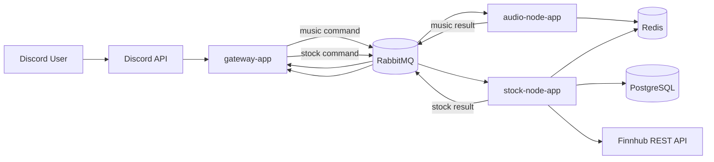
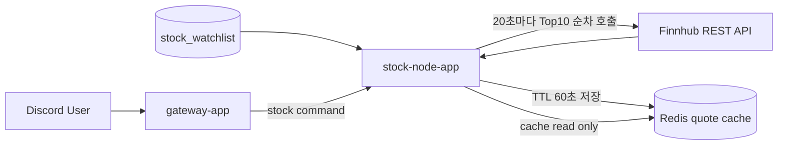

# 현재 아키텍처

## 요약

DIS는 Discord 음악 봇 기능과 모의 주식 게임 기능을 함께 운영하는 멀티 애플리케이션 저장소다.

실행 애플리케이션:

- `gateway-app`
- `audio-node-app`
- `stock-node-app`

공용 모듈:

- `modules/common-core`
- `modules/stock-core`

음악과 주식 명령은 모두 `gateway-app`에서 Discord slash command로 시작하고, 실제 작업은 RabbitMQ를 통해 각 worker가 처리한다.

## 전체 구성

## 앱 책임

### gateway-app

- Discord slash command 진입점
- interaction `deferReply` 처리
- music/stock command envelope 생성
- RabbitMQ publish
- result event 수신 후 Discord original reply 수정

### audio-node-app

- 음악 명령 consumer
- 재생, queue 처리, recovery, idle disconnect
- Redis 기반 playback state 저장
- music result event publish

### stock-node-app

- 주식 명령 consumer
- quote 조회, 매수/매도, 잔고/포트폴리오/거래내역/랭킹 처리
- PostgreSQL 영속 계층 사용
- Redis quote cache, rank cache, lock, rate limit 사용
- Finnhub REST API를 20초 주기로 호출해 quote cache 갱신
- quote 갱신 후 자동 청산 검사

## 데이터 저장소 역할

| 구성요소 | 역할 |
| --- | --- |
| Redis | 음악 상태, pending interaction, stock quote cache, rank cache, lock, rate limit |
| RabbitMQ | music command/result, stock command/result 비동기 transport |
| PostgreSQL | stock account, position, ledger, snapshot, watchlist 저장 |

## 주식 명령 흐름

1. 사용자가 Discord에서 `/stock` 하위 명령을 실행한다.
2. `gateway-app`이 공개 또는 비공개 deferred reply를 시작한다.
3. `gateway-app`이 `StockCommandEnvelope`를 RabbitMQ로 publish한다.
4. `stock-node-app`이 consume 후 quote/거래/조회/랭킹 로직을 수행한다.
5. `stock-node-app`이 `StockCommandResultEvent`를 publish한다.
6. `gateway-app`이 result event를 받아 원래 interaction 응답을 수정한다.

## 주식 시세 갱신 흐름

중요 정책:

- Discord 명령 처리 중 외부 API를 직접 호출하지 않는다.
- 거래는 Redis의 45초 이내 fresh quote가 있을 때만 허용한다.
- 조회는 stale quote를 허용할 수 있으나 사용자에게 stale 안내를 붙인다.

## Discord 응답 공개 범위

공개 응답:

- `/stock buy`
- `/stock sell`
- `/stock rank`

비공개 응답:

- 모든 음악 명령
- `/stock quote`
- `/stock list`
- `/stock balance`
- `/stock portfolio`
- `/stock history`

## 관측성 현재 상태

Prometheus scrape 대상:

- `gateway-app`
- `audio-node-app`
- `stock-node-app`
- `redis-exporter`
- `postgres-exporter`
- `rabbitmq`
- `prometheus`
- `loki`
- `alloy`

로그 수집:

- Alloy가 Docker stdout을 수집해 Loki로 전송한다.
- `gateway-app`, `audio-node-app`, `stock-node-app` 로그가 모두 수집 대상이다.

stock-node 주요 메트릭:

- `stock_commands_total`
- `stock_command_duration_seconds`
- `stock_quote_refresh_success_total`
- `stock_quote_refresh_failures_total`
- `stock_quote_cache_expected`
- `stock_quote_cache_ready`
- `stock_quote_cache_stale`
- `stock_quote_cache_oldest_age`
- `stock_trade_executions_total`
- `stock_trade_rejections_total`
- `stock_auto_liquidations_total`
- `stock_provider_rate_limit_exceeded_total`
